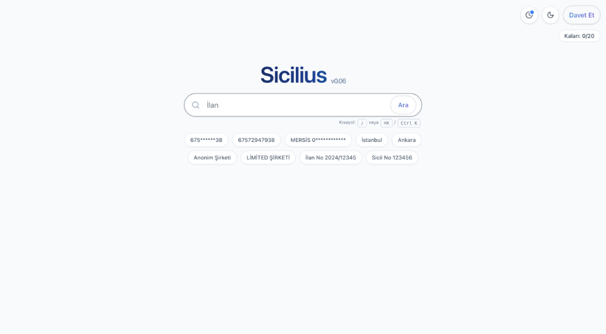

# 🏢 Sicilius - Şirket Araştırma Platformu

<div align="center">


**Türkiye Ticaret Sicil Gazetesi verilerini analiz eden, yapay zeka destekli akıllı şirket araştırma platformu.**

[Demo](https://sicilius.com.tr) • [Dokümantasyon](#-özellikler) • [Kurulum](#-kurulum)

</div>

---

## 📸 Önizleme

<div align="center">



*Sicilius ana arama ekranı - Hızlı ve akıllı şirket araması*

</div>

---

## 🎯 Genel Bakış

Sicilius, Türkiye Ticaret Sicil Gazetesi'nde yayınlanan şirket ilanlarını otomatik işleyerek, şirket bilgilerini yapılandırılmış bir veritabanında toplayan ve kullanıcılara güçlü arama ve analiz araçları sunan bir platformdur.

### 📊 Kullanım Alanları

- **Piyasa Araştırması:** Şirket kuruluşları ve değişikliklerini takip edin
- **Due Diligence:** Şirket geçmişlerini detaylı inceleyin
- **İlişki Haritalama:** Şirketler arası bağlantıları keşfedin
- **Trend Analizi:** Sektörel trendleri analiz edin

---

## ✨ Özellikler

### 🔍 Akıllı Arama
- Fuzzy search ile esnek şirket araması
- NACE kodu ve sicil bazlı filtreleme
- Ortak yönetici/hissedar ilişkisi tespiti
- Coğrafi konum bazlı arama

### 📊 Veri Görselleştirme
- Zaman serisi grafikleri
- İnteraktif harita görünümü
- Detaylı şirket profilleri
- Excel/PDF export

### 🛡️ Admin Özellikleri
- Kullanıcı yönetimi
- Email inbox yönetimi
- Hata raporlama sistemi
- Kullanım istatistikleri

---

## 🛠 Teknoloji Stack

### Backend
- FastAPI - Modern Python web framework
- PostgreSQL + PostGIS - Veritabanı
- Redis - Cache layer
- Minio - Object storage

### Frontend
- Next.js 14 - React framework
- Tailwind CSS - Styling
- Leaflet - Harita görselleştirme
- TypeScript - Type safety

---

## 🚀 Kurulum

### Docker ile (Önerilen)

```bash
# Repository'yi klonlayın
git clone <repo-url>
cd sicilius

# Environment variables ayarlayın
cp backend/.env.example backend/.env
cp frontend/.env.local.example frontend/.env.local

# Container'ları başlatın
docker-compose up -d --build

# Database migration
docker-compose exec backend alembic upgrade head
```

Uygulama şu adreslerde çalışacaktır:
- Frontend: http://localhost:3000
- Backend API: http://localhost:5001
- API Docs: http://localhost:5001/docs

### Yerel Geliştirme

Detaylı kurulum bilgisi için ilgili klasörlerdeki README dosyalarına bakınız:
- [Backend README](backend/README.md)
- [Frontend README](frontend/README.md)

---

## 📚 API Dokümantasyonu

API endpoint'lerini keşfetmek için Swagger UI:
```
http://localhost:5001/docs
```

---

## 📂 Proje Yapısı

```
sicilius/
├── backend/          # FastAPI backend service
├── frontend/         # Next.js frontend app
├── ocr_app/          # OCR companion app
└── docker-compose.yml
```

---

## 🔒 Güvenlik

- JWT tabanlı authentication
- Role-based access control
- Rate limiting
- Input validation
- HTTPS/TLS desteği

---

## 📝 Lisans

Bu proje MIT lisansı altında lisanslanmıştır.

---

## 📧 İletişim

- **Website:** [sicilius.com.tr](https://sicilius.com.tr)
- **Email:** info@sicilius.com.tr

---

<div align="center">

**Made with ❤️ by Sicilius Team**

⭐ Bu projeyi beğendiyseniz yıldız vermeyi unutmayın!

</div>
